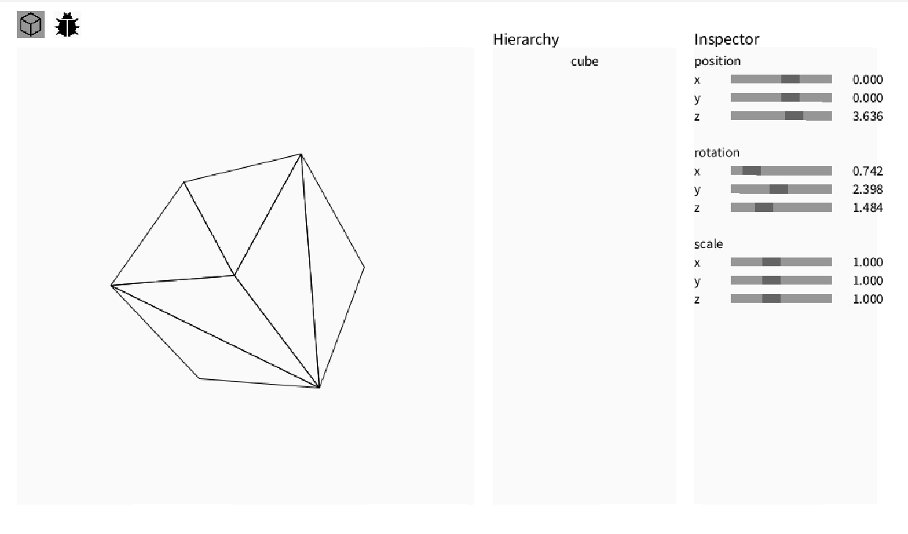

# HW3
https://hackmd.io/@lab31718/CGlab3


## completed
- [x] Model Transformation (Model Matrix)
- [x] Camera Transformation (View Matrix)
- [x] Perspective Rendering (Projection Matrix)
- [x] Depth Buffer
- [x] Camera Control
- [x] Backculling


## Model Transformation (Model Matrix)


### Description
localToWorld的關鍵在於計算矩陣經過各種轉換之後的結果，將所有轉換矩陣進行相乘
```
return Matrix4.Trans(transform.position)
    .mult(Matrix4.RotY(transform.rotation.y))
    .mult(Matrix4.RotX(transform.rotation.x))
    .mult(Matrix4.RotZ(transform.rotation.z))
    .mult(Matrix4.Scale(transform.scale));
```

## Camera Transformation (View Matrix)

### Description
首先先利用lookat的座標和攝影機位置計算出Forward Vector
```
float fx = lookat.x - pos.x;
float fy = lookat.y - pos.y;
float fz = lookat.z - pos.z;
float f_len = sqrt(fx * fx + fy * fy + fz * fz);
Vector3 vecF = new Vector3(fx / f_len, fy / f_len, fz / f_len);
```

接著利用Forward Vector和topVector計算Right Vector
```
float rx = vecF.y * up.z - vecF.z * up.y;
float ry = vecF.z * up.x - vecF.x * up.z;
float rz = vecF.x * up.y - vecF.y * up.x;
float r_len = sqrt(rx * rx + ry * ry + rz * rz);
Vector3 vecR = new Vector3(rx / r_len, ry / r_len, rz / r_len);
```

最後利用Forward Vector和Right Vector計算出Up Vector，這樣就可以獲得以攝影機為基準的座標軸，可用來將世界座標系統轉換到相機座標系統
```
float ux = vecR.y * vecF.z - vecR.z * vecF.y;
float uy = vecR.z * vecF.x - vecR.x * vecF.z;
float uz = vecR.x * vecF.y - vecR.y * vecF.x;
Vector3 vecU = new Vector3(ux, uy, uz);
```

## Perspective Rendering (Projection Matrix)


### Description
首先先計算基礎值
aspect為寬高比，用來調整x軸的縮放
fovRad是將GH_FOV轉換為弧度
```
wid = w;
hei = h;
near = n;
far = f;
float aspect = (float)wid / (float)hei;
float fovRad = radians(GH_FOV);
```

計算Projection Matrix
```
projection = [
  1/(tan(FOV/2)*aspect)    0                  0                    0
  0                        1/tan(FOV/2)       0                    0
  0                        0      -(far+near)/(far-near)   -2*far*near/(far-near)
  0                        0                 -1                    0
]
```

reference:
https://hackmd.io/@23657689/projection_matrix


## Depth Buffer


### Description
首先先計算傳入的點的z座標，利用y軸平行相交兩邊的計算方式
```
Vector3 pre = vertex[vertex.length - 1];
Vector3 A = new Vector3(), B = new Vector3();
for (Vector3 p : vertex) {
    if (p.y >= y && pre.y <= y) {
        A.x = ((y - pre.y) / (p.y - pre.y)) * (p.x - pre.x) + pre.x;
        A.y = y;
        A.z = ((y - pre.y) / (p.y - pre.y)) * (p.z - pre.z) + pre.z;
    }
    else if(p.y <= y && pre.y >= y) {
        B.x = ((y - pre.y) / (p.y - pre.y)) * (p.x - pre.x) + pre.x;
        B.y = y;
        B.z = ((y - pre.y) / (p.y - pre.y)) * (p.z - pre.z) + pre.z;
    }
    pre = p;
}
float z = ((x - A.x) / (B.x - A.x)) * (B.z - A.z) + A.z;
```

接著利用最近的z值和最遠的z值進行正規化
```
float minZ = Float.POSITIVE_INFINITY;
float maxZ = Float.NEGATIVE_INFINITY;
for (Vector3 v : vertex) {
    if (v.z <= minZ) minZ = v.z;
    if (v.z >= maxZ) maxZ = v.z;
}
if (abs(maxZ - minZ) < 1e-6) {
    return 0;
}
return (z - minZ) / (maxZ - minZ);
```

但這樣的結果會因為模型的三角形最近的z點與另一個同一面但三角形最近的z點不一致會導致中間的分割線顏色又加深的情況，可能需要獲得模型整體最近的z點和最遠的z點來改善

## Camera Control


### Description
利用keyPressed事件和所按的鍵來變更攝影機的位置
```
if(keyPressed){
    if (key == 'a' || key == 'A') {
        cam_position.x -= 0.1;
    }
}
```

## Backculling


### Description
計算面的z向量，如果是背對攝影機就不渲染
```
Vector3 edge1 = Vector3.sub(img_pos[1], img_pos[0]);
Vector3 edge2 = Vector3.sub(img_pos[2], img_pos[0]);
Vector3 normal = Vector3.cross(edge1, edge2);

if (normal.z <= 0) continue;
```
