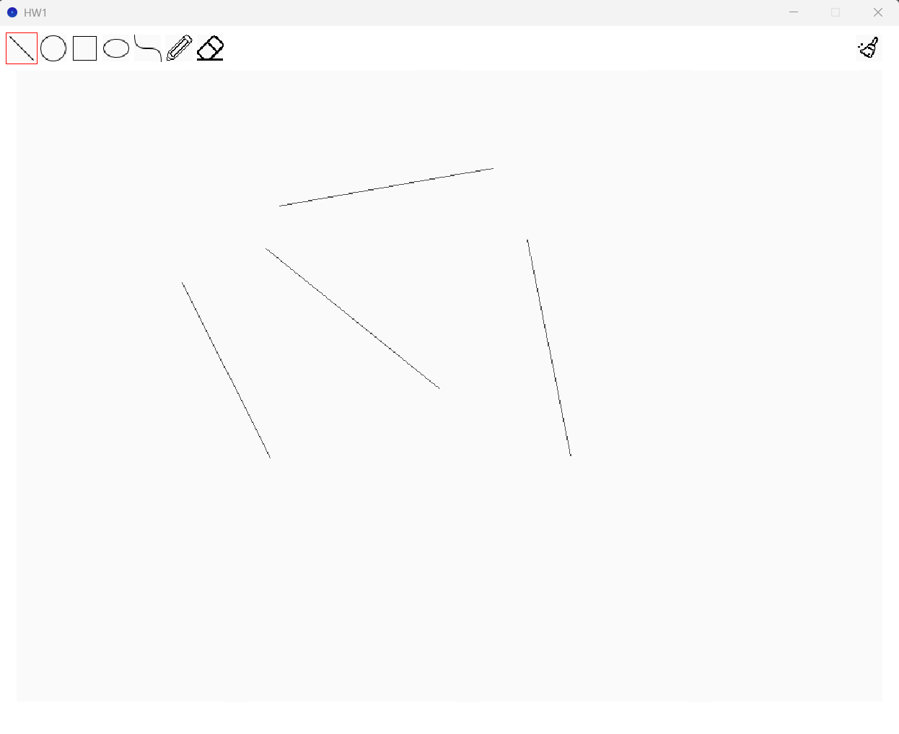
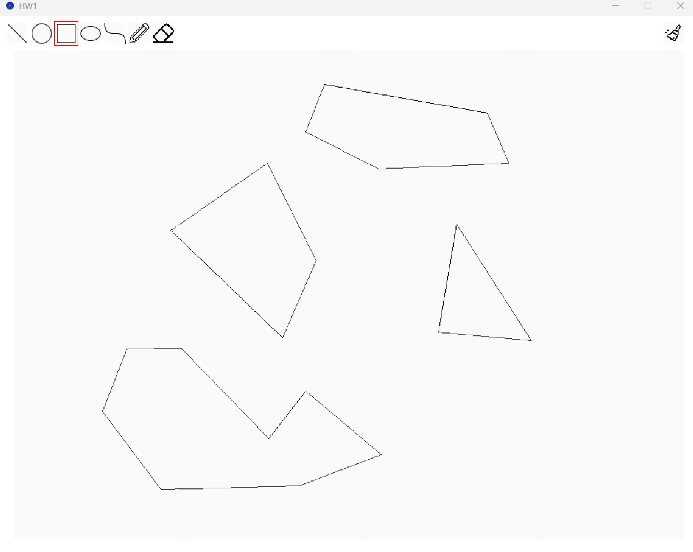
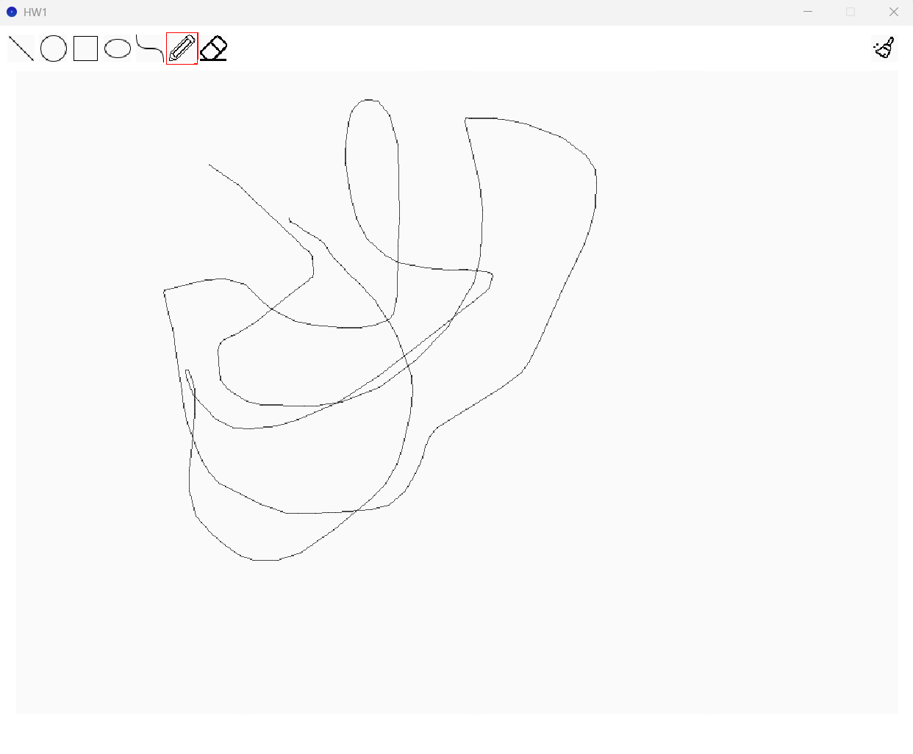
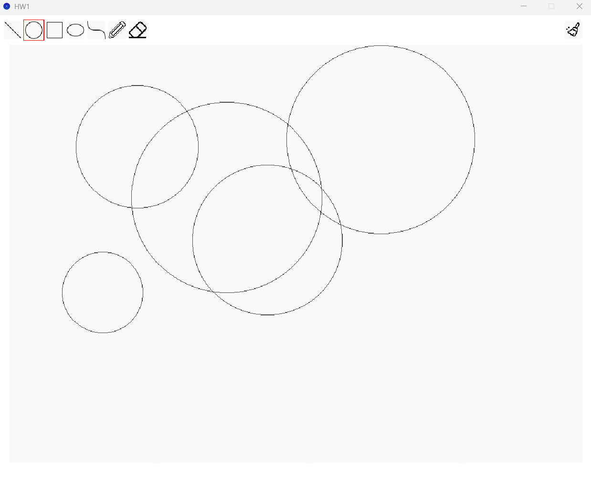
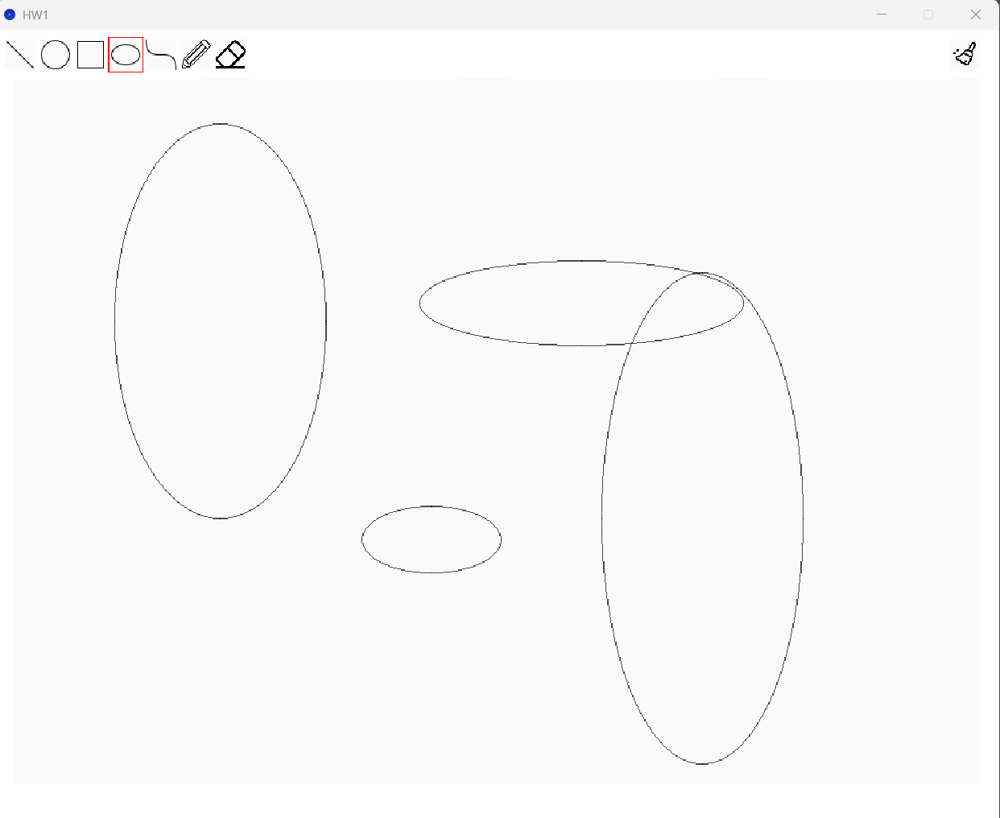
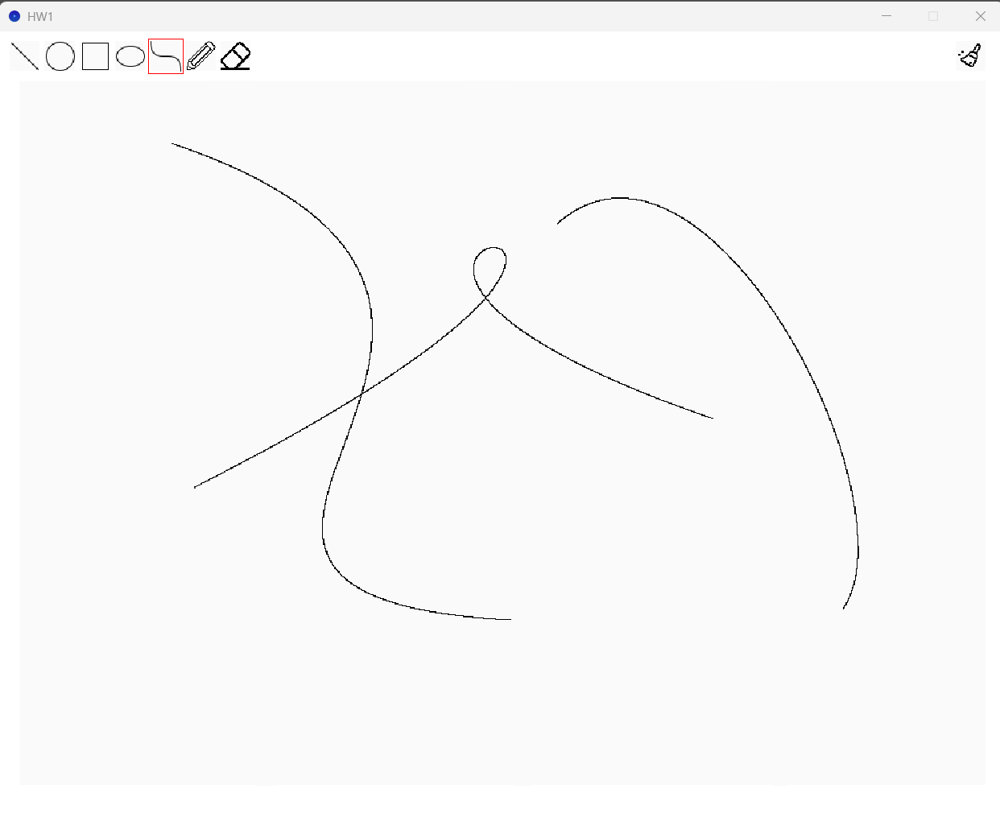
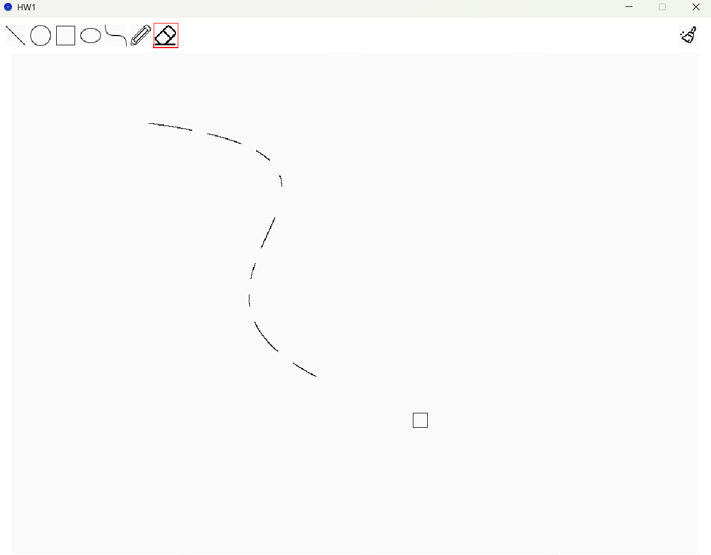

# HW1
https://hackmd.io/@lab31718/CGlab1

## completed
- [x] line algorithm
- [x] circle algorithm
- [x] ellipse algorithm
- [x] curve algorithm
- [x] eraser

## Line Algorithm

### Description
I use mid-point line generation algorithm.
I first draw the line in one direction(x2 > x1 and y2 > y1).
First, I check if dy <= dx or not 
and then use d to chose which one (E(x+1) or SE(x+1 , y+1) ) need to draw.

When I can draw one direction line, I flip it to draw the line in four direction.

### Ref Mid-Point Line Generation Algorithm
https://www.geeksforgeeks.org/dsa/mid-point-line-generation-algorithm/

## Circle Algorithm

### Description
I use mid-point Circle generation algorithm.
First, I calculate all the perimeter points of the circle in the first octant and then print them along with their mirror points in the other octant.

`xk` means now x positon and `yk` means now y position.
Use P to chose which one (xk, yk+1) or (xk+1, yk+1) need to draw, until xk < yk

### Ref Mid-Point Circle Generation Algorithm
https://www.geeksforgeeks.org/dsa/mid-point-circle-drawing-algorithm/

## Ellipse Algorithm

### Description
I use mid-point Ellipse generation algorithm.
I Plot points of an ellipse on the first quadrant by dividing the quadrant into two regions, and then profect them into other three quadrants.

Use `d1` in region 1 and `d2` in region 2, and then determine if the point outside the ellipse or not.

### Ref Mid-Point Ellipse Drawing Algorithm
https://www.geeksforgeeks.org/dsa/midpoint-ellipse-drawing-algorithm/

## Curve Algorithm

### Description
I use De Casteljau’s algorithm.

1. Connect control points
2. For each t in the interval from 0 to 1
3. Take points on these segments on the distance proportional to t from the beginning, and then connect them, repeat this step until get one point

`P = (1−t)^3 *P1 + 3(1−t) ^2 *t *P2 +3(1−t) *t^2 *P3 + t^3 * P4` is the formula

### Ref Bezier Curve
https://javascript.info/bezier-curve

## Eraser

### Description
I draw background color point in the eraser square.
But I found that if I erase too many areas, the program will becomes laggy.
So I asked chatGPT about this issue, and it recommended that I store the points to be drawn in an array and render them all at once, but it doesn’t seem to help much.