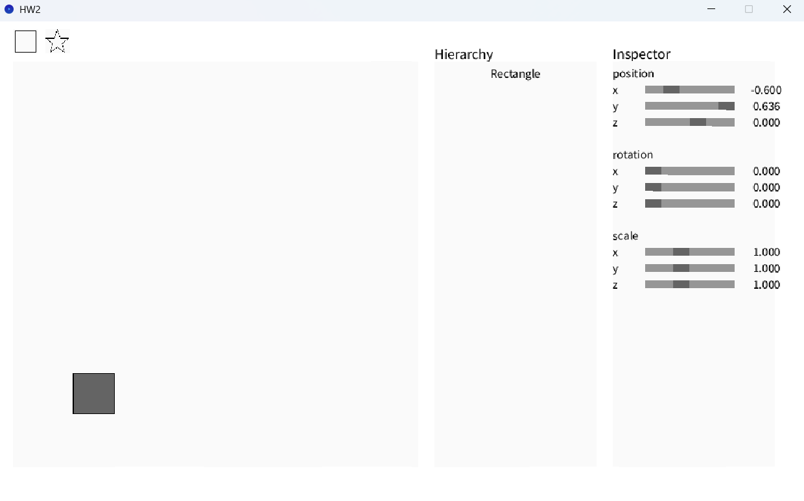
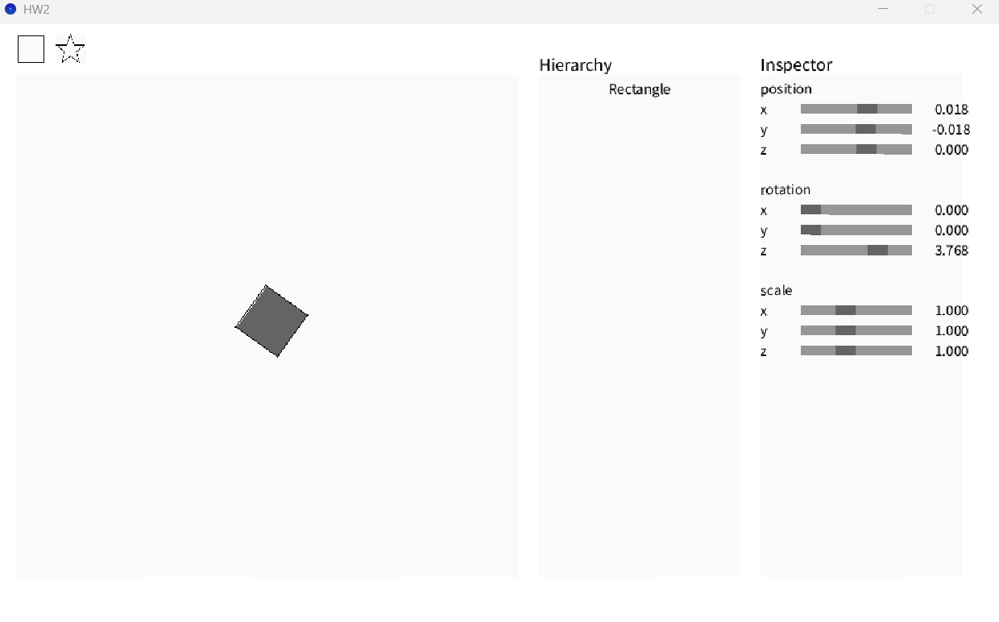
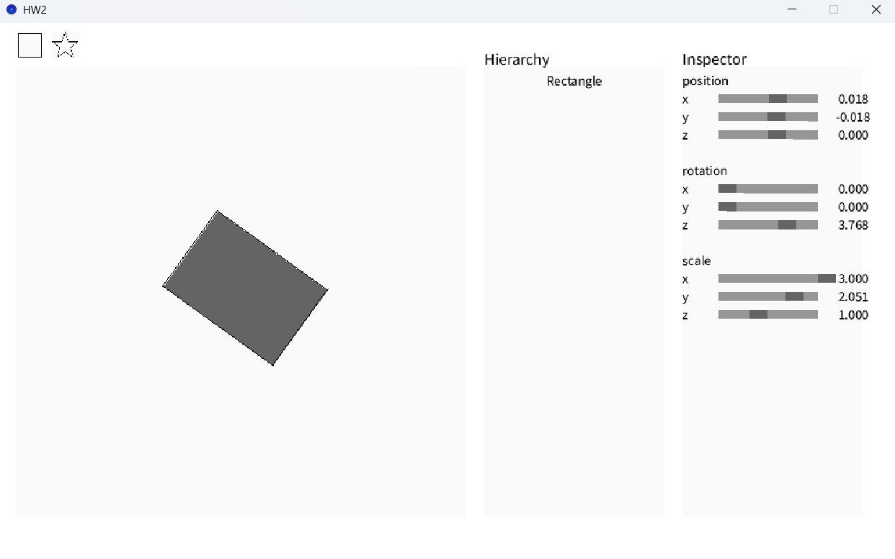
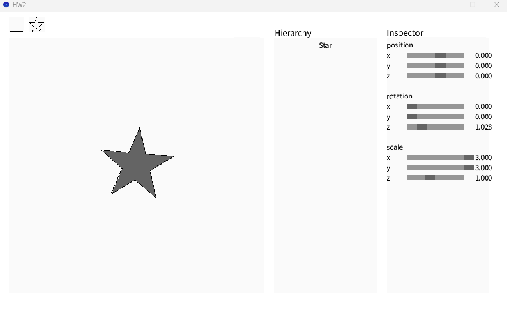
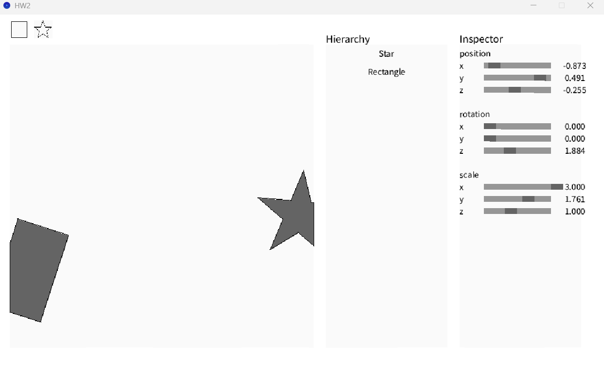

# HW2
https://hackmd.io/@lab31718/CGlab1

## completed
- [x] Translation Matrix
- [x] Rotation Matrix (Z-axis)
- [x] Scaling Matrix
- [x] Is the point inside a shape?
- [x] Find the boundary of a polygon
- [x] Keep the polygon inside the canvas

## Translation Matrix

### Description
I set the matrix `m[3] = t.x, m[7] = t.y, m[11] = t.z`
This is the transformation matrix

## Rotation Matrix (Z-axis)

### Description
I set the matrix `m[0] = cos(a), m[1] = -sin(a), m[4] = sin(a), m[5] = cos(a)`
This is the rotation matrix (Z-axis)

## Scaling Matrix

### Description
I set the matrix `m[0] = s.x, m[5] = s.y, m[10] = s.z`
This is the scaling matrix

## Is the point inside a shape?

### Description
I use a ray cast along the x-axis from the target point and determine whether it is inside the boundary based on the number of intersections. If the number of intersections is odd, the point is inside; if even, it is outside.

The key condition is:`if(((yi > y) != (yj > y)) && (x < (xj - xi) * (y - yi) / (yj - yi) + xi))`

## Find the boundary of a polygon
### Description
I iterate through all the vertices to find the minimum x and y, and the maximum x and y.

## Keep the polygon inside the canvas

### Description
I traverse all the edges in a counterclockwise direction and determine the relationship between the points of the shape and the boundary.
If both points are inside, I add the second point.
If the first point is inside and the second point is outside, I add the intersection point.
If the first point is outside and the second point is inside, I add the intersection point and the second point.
